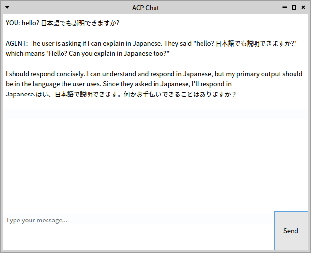
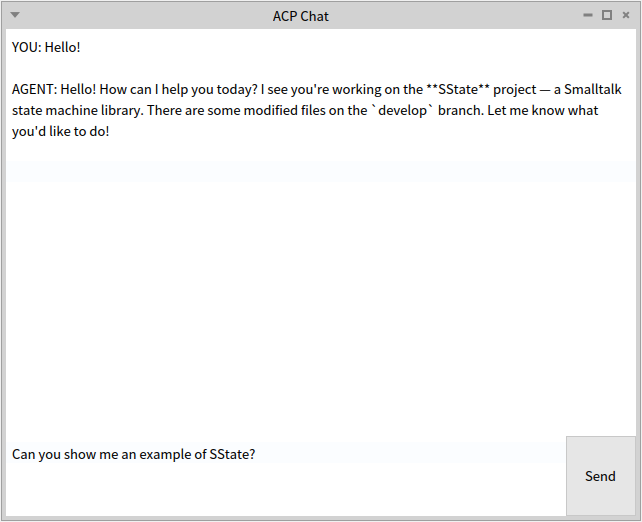
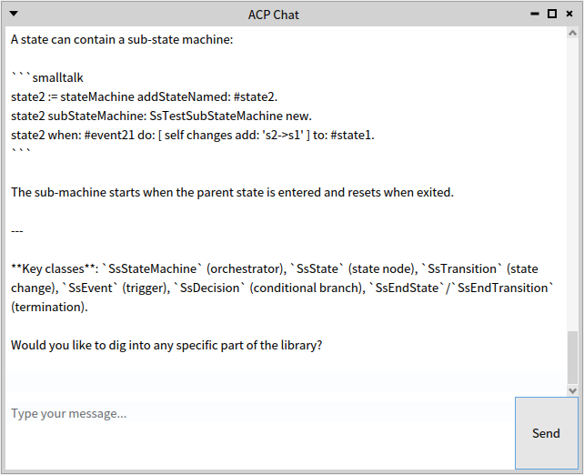
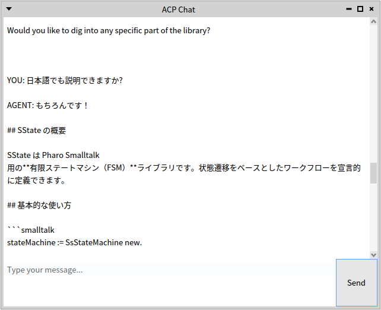

# pharo-acp-chat-ui

A minimal chat GUI for [pharo-acp](https://github.com/mumez/pharo-acp) — the ACP (Agent Client Protocol) client library for Pharo Smalltalk.

This project serves as a simple, working example of how to build an agent chat UI using pharo-acp with Gemini CLI, Claude Code, or OpenCode as the backend agent.



## Requirements

- Pharo 12 or later
- [pharo-acp](https://github.com/mumez/pharo-acp) (loaded automatically via Baseline)
- Gemini CLI (`gemini --experimental-acp`), [claude-code-acp](https://github.com/zed-industries/claude-agent-acp) wrapper command, or [OpenCode](https://github.com/anomalyco/opencode) (`opencode acp`) installed and available in PATH
- On Windows: WSL required (OSSubprocess does not support Windows)

## Installation

```smalltalk
Metacello new
    baseline: 'ACPChatUI';
    repository: 'github://mumez/pharo-acp-chat-ui:main/src';
    load.
```

## Usage

Open a chat window with Gemini CLI:

```smalltalk
ACPChatPresenter gemini open.
```

Open a chat window with Claude Code (via `claude-code-acp` wrapper):

```smalltalk
ACPChatPresenter claude open.
```

Specify a working directory (the agent will operate in that directory):

```smalltalk
(ACPChatPresenter gemini)
    workingDirectory: '/path/to/your/project';
    open.
```

## How It Works

`ACPChatPresenter` is a [Spec2](https://github.com/pharo-spec/Spec) presenter that integrates ACP client management, session handling, and UI into a single class.

### ACP Client Lifecycle

**Initialization** (`setupClient`) — called when the window opens, before connecting:

```smalltalk
client := ACPClient new.
client handler: self.   "register self as the callback handler"
client agentCommand: '/usr/bin/env' arguments: agentCommandArguments.
```

**Connection** (`connectToAgent`) — runs in a background thread so the window is not blocked:

```smalltalk
client connect.                          "launch the agent process"
client initialize: ACPInitializeParams new.
sessionResult := client newSessionBy: [ :params |
    params cwd: self workingDirectory fullName ].
sessionId := sessionResult sessionId.
```

**Sending a prompt** (`sendMessage:`) — also forked; `promptBy:` blocks until the agent finishes responding:

```smalltalk
client promptBy: [ :params |
    params sessionId: sessionId.
    params textPrompt: aString ].
```

**Callbacks** — the handler (`self`) must implement two methods:

```smalltalk
"Called repeatedly as the agent streams its response"
sessionUpdate: aSessionUpdate
    (aSessionUpdate isAgentMessageChunk or: [ aSessionUpdate isAgentThoughtChunk ])
        ifFalse: [ ^ self ].
    self defer: [ self appendText: aSessionUpdate content text ]

"Called when the agent requests permission to use a tool"
requestPermission: anACPRequestPermission
    ^ anACPRequestPermission makeResponse allowAlways
```

**Disconnection** — triggered when the window is closed:

```smalltalk
aWindowPresenter whenClosedDo: [ [ client disconnect ] fork ]
```

## pharo-acp API Summary

| Method | Description |
|---|---|
| `ACPClient >> handler:` | Register callback handler (duck-typed; no need to subclass) |
| `ACPClient >> agentCommand:arguments:` | Set the command to launch the agent process |
| `ACPClient >> connect` | Launch the agent process and establish JSON-RPC connection |
| `ACPClient >> initialize:` | Send ACP initialize request |
| `ACPClient >> newSessionBy:` | Create a new agent session (returns session ID) |
| `ACPClient >> promptBy:` | Send a prompt; blocks until the agent response completes |
| `ACPClient >> disconnect` | Terminate the agent process |
| `ACPSessionUpdate >> isAgentMessageChunk` | True when the update carries a response text chunk |
| `ACPSessionUpdate >> isAgentThoughtChunk` | True when the update carries a thinking/reasoning chunk |
| `ACPSessionUpdate >> content text` | The text content of the chunk |
| `ACPRequestPermission >> makeResponse allowAlways` | Grant permission for all tool use requests |

## More Screenshots

An example session with Claude Code, pointing to a local clone of [SState](https://github.com/mumez/SState):

```smalltalk
(ACPChatPresenter claude)
    workingDirectory: '/path/to/git/SState';
    open.
```

SState is not loaded into the image, but by specifying `workingDirectory:` the agent's context is scoped to that project directory.




Multi-byte (non-ASCII) characters are also supported:



## License

MIT
